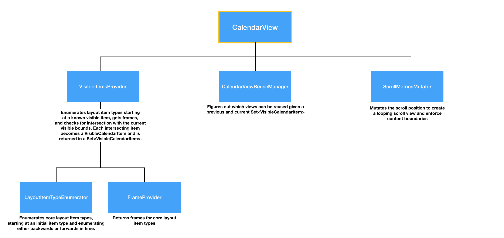

#  Technical Details
`HorizonCalendar` features a completely custom layout solution, enabling it to scale from small date pickers to large calendars that display virtually infinite date ranges. Whether you're showing 1 year worth of dates or 100,000 years worth of dates, `HorizonCalendar` will have the same memory footprint and scroll performance.

This document provides an overview of the technical implementation details of `HorizonCalendar`. Whether you're looking to contribute or just interested in how `HorizonCalendar` works, this document will get you up to speed.

## Why not use `UICollectionView`?
`HorizonCalendar`'s original implementation used `UICollectionView` with a custom `UICollectionViewLayout`. This worked pretty well when displaying just one or two years worth of dates, but performance became unacceptable when displaying larger ranges. The main issue is that collection view's memory usage increases linearly as you scroll past items.

| UICollectionView Memory Usage | HorizonCalendar Memory Usage |
| ---- | ---- |
|  |  |

After 24 seconds of scrolling, the `UICollectionView` "calendar" resulted in memory usage skyrocketing to nearly 100 MB. The `HorizonCalendar` implementation never surpassed 30 MB, with its memory usage slope going flat after just a couple of seconds.

----

Aside from performance concerns, `UICollectionView` also felt like the wrong tool for the job due to the following limitations:

- Flaky `scrollToItem` support that fails silently if called before the collection view has laid out
- A batch update API that encourages diffing every element in the data source upfront to generate a complete set of update actions - something we can't do if we're showing several years worth of dates
- A layout and data source that are too decoupled for `HorizonCalendar`'s feature requirements, making it difficult to create calendar items that depend on parts of the layout being resolved when querying the data source (day range items need to know the frames of the items in their associated day range, for example)
- Difficult to write unit tests to ensure layout and behavior correctness

Having built and maintained `MagazineLayout` for the past several years, I'm also all too familiar with collection view's quirks. By writing a custom layout solution for `HorizonCalendar`, I've reduced the number of hacky `UIKit` workarounds to _zero_. We control our own destiny in this project :)

## Architecture Overview

### Intro

The core philosphy backing `HorizonCalendar`'s architecture is that its CPU and memory usage should be dependent only on the number of items on screen at any given time. In other words, displaying 1 year worth of dates or 100,000 years worth of dates should have identical performance characteristics as long as the number dates visible in the current viewport is the same.

Achieving this requires a layout solution that can lazily render the calendar just-in-time, at scroll time. Since the layout can resolve in real time, there's no need to cache layout information for parts of the calendar that are not visible, enabling us to keep memory usage to a minimum.

### Architecture Diagram

### Architecture Walkthrough

`HorizonCalendar`'s `CalendarView` type is the `UIView` subclass that connects all other parts of the architecture, and ultimately displays the subviews that represent the content of the calendar. Rendering the content can be broken down into three steps:

1. Figure out what parts of the calendar are currently visible
2. Create and reuse views for the set of currently visible items
3. Mutate the scroll position to create an infinitely scrolling / looping scroll view

The majority of the work is done in step 1, so let's start with that.

#### Getting the set of visible calendar items

First, we need to figure out what subset of the calendar is currently visible. To do this, we need two things:

1. A visible viewport, which is just the current `scrollView.bounds`
2. An item in the visible viewport

When `CalendarView` is first laid out, we bootstrap it with an initially visible item for the month header of the first month. Using the frame of the first visible month header and the current visible viewport, we can look at adjacent items until we've determined every currently visible item for the current viewport. This process is performed by the `VisibleItemsProvider`, and repeats for every layout pass as the calendar is scrolling. As the calendar scrolls, the visible viewport changes and the frames of the visible items in the current viewport change, resulting in different sets of calendar items being returned from the `VisibleItemsProvider`.

The `VisibleItemsProvider`  takes a visible item and looks at all adjacent items using the `LayoutItemTypeEnumerator`. For each adjacent layout item type, the `VisibleItemsProvider` gets a frame for that item using the `FrameProvider`. If an adjacent item's frame is in the current visible bounds, then we make a `VisibleCalendarItem` for it and add it to the set of visible calendar items that gets returned to `CalendarView`.

#### Getting frames

Since our layout is being built both lazily and incrementally, always based on the frame of some existing known visible item, our `FrameProvider` can take many shortcuts to determine the frames of items in the calendar. For example, there's a function that provides the `CGPoint` origin for a particular `Month`, given the origin of an adjacent month that's already been laid out. Similarly, there's function that provides the frame of a day given the frame of a previously laid out adjacent day - either one day before or one day after.

By taking an incremental approach to laying out items, always basing our calculations on the frames of previously laid out items, we're able to layout the calendar at any arbitrary date offset without knowing anything about how many items are before or after our current scroll position.

#### Creating and reusing views

Using the `LayoutItemTypeEnumerator` and `FrameProvider`, the `VisibleItemsProvider` is able to return a `Set<VisibleCalendarItem>`. This set represents everything that's currently visible.

`CalendarView` uses this set, along with the previous set of visible items, to determine which parts have changed. The difference between these two sets is used to create new views when necessary, or reuse existing views that have been scrolled off screen and can be repurposed. This process is very similar to `UICollectionView`'s view reuse, and the bulk of the logic is contained in `ItemViewReuseManager`.

Once the reuse manager determines which views can be reused vs. made from scratch, `CalendarView` will update the view model on that view so that its displaying the latest data from the content.

#### Manage the underlying scroll view

The final step of layout is updating the internal `UIScrollView`'s metrics to either

- Create a scroll boundary if we're at the edge of the range of dates being shown
- Loop the scroll position to provide the illusion of infinite scrolling

Since `HorizonCalendar` supports showing infinitely large date ranges, looping the scroll position of the internal scroll view is necessary so that our offset doesn't increase toward infinity as we scroll past more and more dates. And since the calendar is laid our lazily, we don't know when we're about to hit a scroll boundary until right before the first or last date comes into view.

To support creating native scroll view boundary behavior (overscroll bouncing) and virtually-infinite scroll when you're not at a boundary, `CalendarView` calls into the `ScrollMetricsMutator` to handle updating our scroll view's metrics in the right ways. Since the scroll metrics mutation is abstracted away in the `ScrollMetricsMutator`, we get the benefit of being able to unit test this unique scroll behavior.
