# HorizonCalendar
A declarative, performant, calendar UI component that supports use cases ranging from simple date pickers all the way up to fully-featured calendar apps.

[](https://github.com/apple/swift-package-manager)
[](https://github.com/Carthage/Carthage)
[](https://cocoapods.org/pods/HorizonCalendar)
[](https://cocoapods.org/pods/HorizonCalendar)
[](https://cocoapods.org/pods/HorizonCalendar)


## Introduction
`HorizonCalendar` is UIKit library for displaying a range of dates in a vertically-scrolling or horizontally-scrolling calendar component. Its declarative API makes updating the calendar straightforward, while also providing many customization points to support a diverse set of designs and use cases.

Features:

- Supports all calendars from `Foundation.Calendar` (Gregorian, Japanese, Hebrew, etc.)
- Display months in a vertically-scrolling or horizontally-scrolling layout
- Declarative API that enables unidirectional data flow for updating the content of the calendar
- A custom layout system that enables virtually infinite date ranges without increasing memory usage
- Specify custom views for individual days, month headers, and days of the week
- Specify custom views to highlight date ranges
- Specify custom views to overlay parts of the calendar, enabling features like tooltips
- A day selection handler to monitor when a day is tapped
- Customizable layout metrics
- Pin the days-of-the-week row to the top
- Show partial boundary months (exactly 2020-03-14 to 2020-04-20, for example)
- Scroll to arbitrary dates and months, with or without animation
- Robust accessibility support
- Inset the content without affecting the scrollable region using `UIView` layout margins
- Separator below the days-of-the-week row

`HorizonCalendar` serves as the foundation for the date pickers and calendars used in Airbnb's highest trafficked flows.

| Search | Stays Availability Calendar | Wish List | Experience Reservation | Experience Host Calendar Management |
| --- | --- | --- | --- | --- |
| 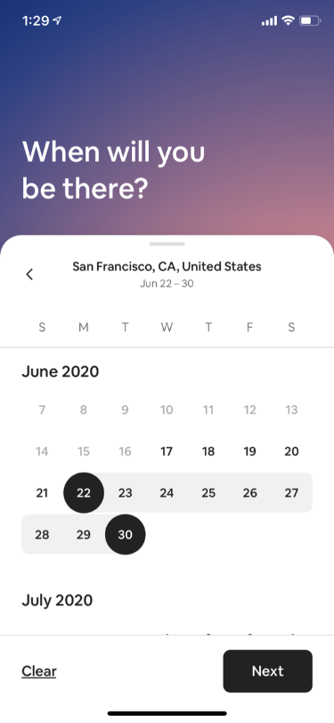 | 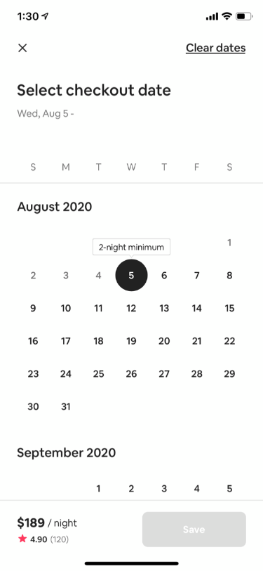  | 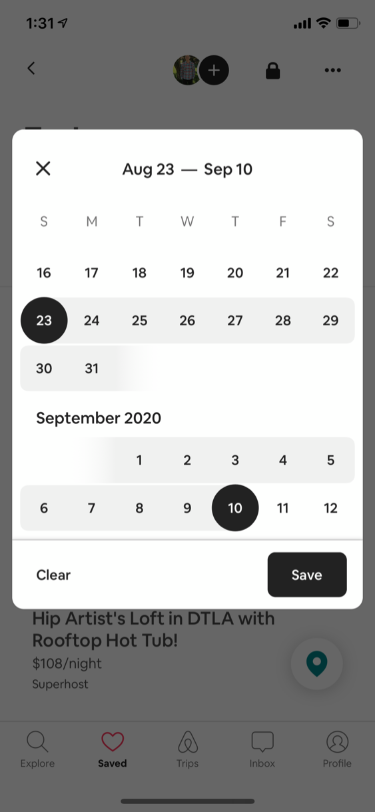 | 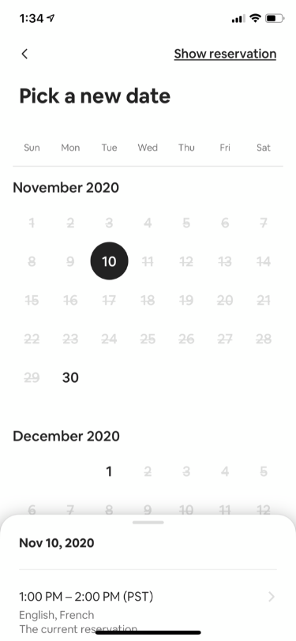 | 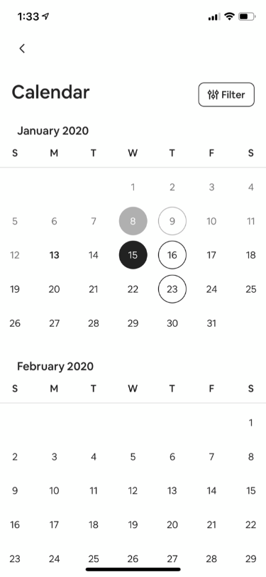 |

## Table of Contents
- [Example App](#example-app)
  - [Demos](#demos)
    - [Single Day Selection](#single-day-selection)
    - [Day Range Selection](#day-range-selection)
    - [Selected Day Tooltip](#selected-day-tooltip)
    - [Scroll to Day with Animation](#scroll-to-day-with-animation)
- [Integration Tutorial](#integration-tutorial)
  - [Requirements](#requirements)
  - [Installation](#installation)
    - [Carthage](#carthage)
    - [CocoaPods](#cocoapods)
  - [Building a `CalendarView`](#building-a-calendarView)
    - [Basic Setup](#basic-setup)
      - [Importing `HorizonCalendar`](#importing-horizoncalendar)
      - [Initializing a `CalendarView` with `CalendarViewContent`](#initializing-a-calendarview-with-calendarviewcontent)
    - [Customizing `CalendarView`](#customizing-calendarview)
      - [Providing a custom view for each day](#providing-a-custom-view-for-each-day)
      - [Adjusting layout metrics](#adjusting-layout-metrics)
      - [Adding a day range indicator](#adding-a-day-range-indicator)
      - [Adding a tooltip](#adding-a-tooltip)
    - [Responding to day selection](#responding-to-day-selection)
- [Technical Details](#technical-details)
- [Contributions](#contributions)
- [Authors](#authors)
- [Maintainers](#maintainers)
- [License](#license)

## Example App
An example app is available to showcase and enable you to test some of `HorizonCalendar`'s features. It can be found in `./Example/HorizonCalendarExample.xcworkspace`. 

Note: Make sure to use the `.xcworkspace` file, and not the `.xcodeproj` file, as the latter does not have access to `HorizonCalendar.framework`.

### Demos
The example app has several demo view controllers to try, with both vertical and horizontal layout variations:

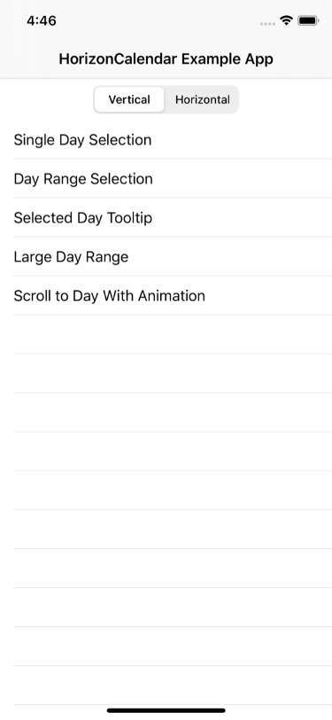

#### Single Day Selection
| Vertical | Horizontal |
| ---- | ---- |
| 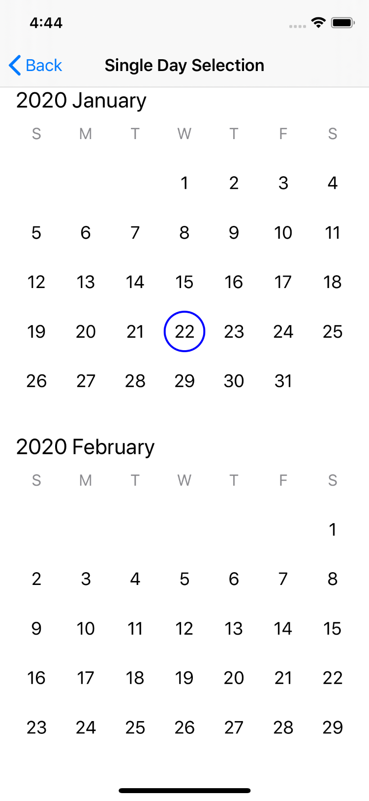 | 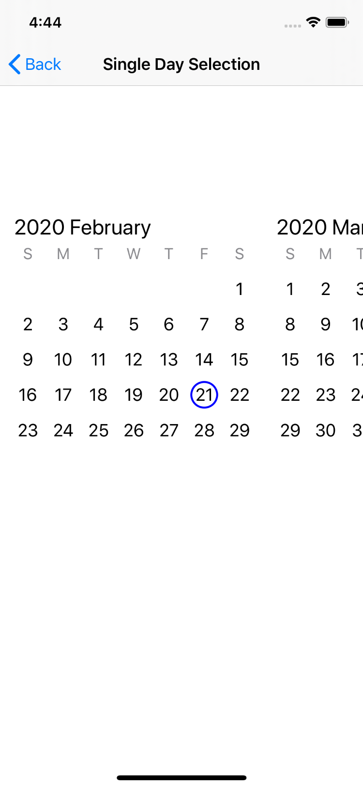 |

#### Day Range Selection
| Vertical | Horizontal |
| ---- | ---- |
| 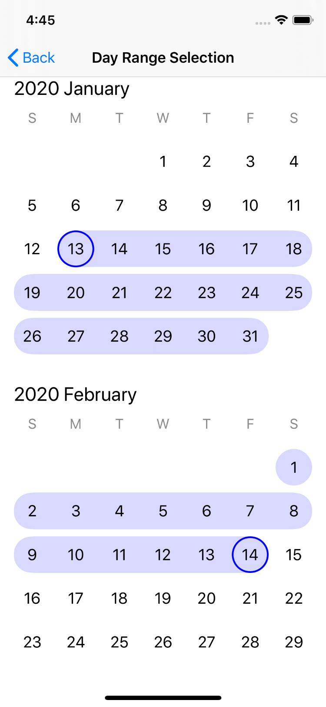 | 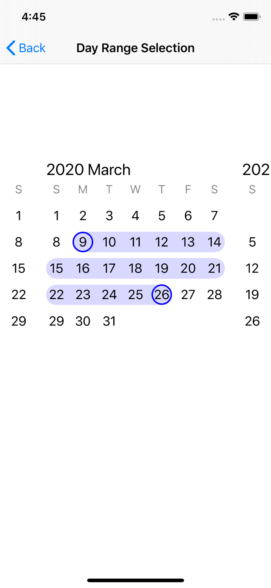 |

#### Selected Day Tooltip
| Vertical | Horizontal |
| ---- | ---- |
| 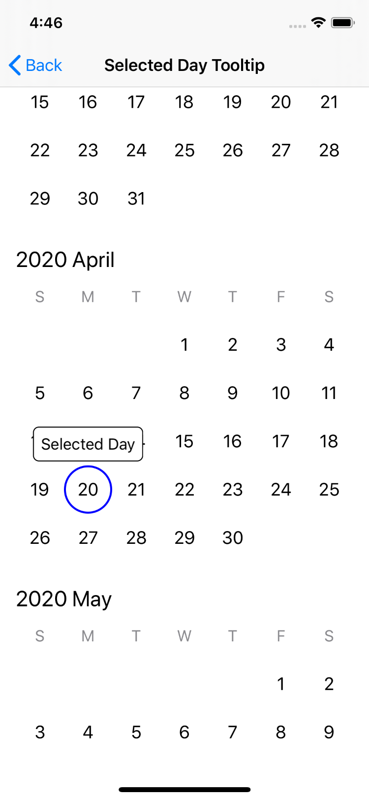 | 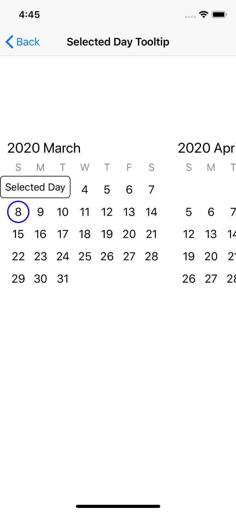 |

#### Scroll to Day with Animation
| Vertical | Horizontal |
| ---- | ---- |
|  | 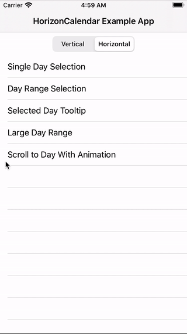 |

## Integration Tutorial

### Requirements
- Deployment target iOS 11.0+
- Swift 5+
- Xcode 10.2+

### Installation
#### Swift Package Manager
To install `HorizonCalendar` using [Swift Package Manager](https://swift.org/package-manager/), add
`.package(name: "HorizonCalendar", url: "https://github.com/airbnb/HorizonCalendar.git", from: "1.0.0"),"` to your Package.swift, then follow the integration tutorial [here](https://swift.org/package-manager#importing-dependencies).

#### Carthage
To install `HorizonCalendar` using [Carthage](https://github.com/Carthage/Carthage), add
`github "airbnb/HorizonCalendar"` to your Cartfile, then follow the integration tutorial [here](https://github.com/Carthage/Carthage#if-youre-building-for-ios-tvos-or-watchos).

#### CocoaPods
To install `HorizonCalendar` using [CocoaPods](http://cocoapods.org), add
`pod 'HorizonCalendar'` to your Podfile, then follow the integration tutorial [here](https://guides.cocoapods.org/using/using-cocoapods.html).


## Building a `CalendarView`
Once you've installed `HorizonCalendar` into your project, getting a basic calendar working is just a few steps.

### Basic Setup

#### Importing `HorizonCalendar`
At the top of the file where you'd like to use `HorizonCalendar` (likely a `UIView` or `UIViewController` subclass), import `HorizonCalendar`:
```swift
import HorizonCalendar 
```

#### Initializing a `CalendarView` with `CalendarViewContent`
`CalendarView` is the `UIView` subclass that renders the calendar. All visual aspects of `CalendarView` are controlled through a single type - `CalendarViewContent`. To create a basic `CalendarView`, you initialize one with an initial `CalendarViewContent`:
```swift
let calendarView = CalendarView(initialContent: makeContent())
```

```swift
private func makeContent() -> CalendarViewContent {
  let calendar = Calendar(identifier: .gregorian)

  let startDate = calendar.date(from: DateComponents(year: 2020, month: 01, day: 01))!
  let endDate = calendar.date(from: DateComponents(year: 2021, month: 12, day: 31))!

  return CalendarViewContent(
    calendar: calendar,
    visibleDateRange: startDate...endDate,
    monthsLayout: .vertical(VerticalMonthsLayoutOptions()))
}
```

At a minimum, `CalendarViewContent` must be initialized with a `Calendar`, a visible date range, and a months layout (either vertical or horizontal). The visible date range will be interpretted as a range of `Day`s using the `Calendar` instance passed in for the `calendar` parameter.

For this example, we're using a Gregorian calendar, a date range of 2020-01-01 to 2021-12-31, and a vertical months layout.

Make sure to add `calendarView` as a subview, then give it a valid frame either using Auto Layout or by manually setting its `frame` property. If you're using Auto Layout, note that `CalendarView` does not have an intrinsic content size.
```swift
view.addSubview(calendarView)

calendarView.translatesAutoresizingMaskIntoConstraints = false

NSLayoutConstraint.activate([
  calendarView.leadingAnchor.constraint(equalTo: view.layoutMarginsGuide.leadingAnchor),
  calendarView.trailingAnchor.constraint(equalTo: view.layoutMarginsGuide.trailingAnchor),
  calendarView.topAnchor.constraint(equalTo: view.layoutMarginsGuide.topAnchor),
  calendarView.bottomAnchor.constraint(equalTo: view.layoutMarginsGuide.bottomAnchor),
])
```

At this point, building and running your app should result in something that looks like this:


### Customizing `CalendarView`

#### Providing a custom view for each day
`HorizonCalendar` comes with default views for month headers, day of week items, and day items. You can also provide custom views for each of these item types, enabling you to display whatever custom content makes sense for your app.

Since all visual aspects of `CalendarView` are configured through `CalendarViewContent`, we'll expand on our `makeContent` function. Let's start by providing a custom view for each day in the calendar:
```swift
private func makeContent() -> CalendarViewContent {
  return CalendarViewContent(
    calendar: calendar,
    visibleDateRange: today...endDate,
    monthsLayout: .vertical(VerticalMonthsLayoutOptions()))
    
    .withDayItemProvider { day in
      // Return a CalendarItem representing the view for each day
    }
}
```

The `withDayItemProvider(_:)` function on `CalendarViewContent` returns a new `CalendarViewContent` instance with the custom day item provider configured. This function takes a single parameter - a provider closure that returns a `CalendarItem` for a given `Day`.

`CalendarItem` is a type that abstracts away the creation and configuration of a `UIView`. Its generic over a `ViewType` and a `ViewModel` type. For example, if we want to use a `UILabel` for our custom day view, its view model type might be a `String` or a `Day` type. The calendar item that we return from our provider closure might look something like this:
```swift
  return CalendarViewContent(...)

    .withDayItemProvider { day in
      CalendarItem<UILabel, Day>(
        viewModel: day,
        styleID: "DayLabelStyle",
        buildView: {
          let label = UILabel()
          label.font = UIFont.systemFont(ofSize: 18)
          label.textAlignment = .center
          label.textColor = .darkGray
          label.clipsToBounds = true
          label.layer.borderColor = UIColor.blue.cgColor
          label.layer.borderWidth = 1
          label.layer.cornerRadius = 12
          return label
        },
        updateViewModel: { label, day in
          label.text = "\(day.day)"
        })
  }
```

Similar functions are available to customize the views used for month headers and day-of-the-week items.

If you build and run your app, it should now look like this:

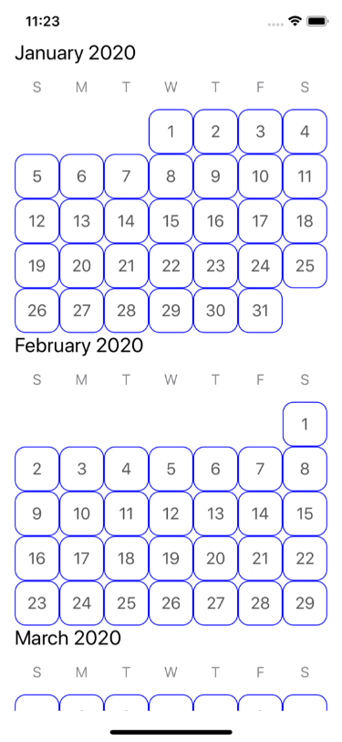

#### Adjusting layout metrics
We can also use `CalendarViewContent` to adjust layout metrics. We can improve the layout of our current `CalendarView` by adding some additional spacing between individual days and months:
```swift
  return CalendarViewContent(...)
    .withDayItemProvider { ... }

    .withInterMonthSpacing(24)
    .withVerticalDayMargin(8)
    .withHorizontalDayMargin(8)
```

Just like when we configured a custom day view via the day item provider, changes to layout metrics are also done through `CalendarViewContent`. `withInterMonthSpacing(_:)`, `withVerticalDayMargin(_:)`, and `withHorizontalDayMargin(_:)` each return a mutated `CalendarViewContent` with the corresponding layout metric value updated, enabling you to chain function calls together to produce a final content instance.

After building and running your app, you should see a much less cramped layout:


#### Adding a day range indicator
Day range indicators are useful for date pickers that need to highlight not just individual days, but ranges of days. `HorizonCalendar` offers an API to do exactly this via the `CalendarViewContent` function `withDayRangeItemProvider(for:_:)`. Similar to what we did for our custom day item provider, for day ranges, we need to provide a `CalendarItem` for each day range we want to highlight.

First, we need to create a `ClosedRange<Date>` that represents the day range for which we'd like to provide a `CalendarItem`. The `Date`s in our range will be interpretted as `Day`s using the `Calendar` instance with which we initialized our `CalendarViewContent`.
```swift
  let lowerDate = calendar.date(from: DateComponents(year: 2020, month: 01, day: 20))!
  let upperDate = calendar.date(from: DateComponents(year: 2020, month: 02, day: 07))!
  let dateRangeToHighlight = lowerDate...upperDate
```

Next, we need to invoke the `withDayRangeItemProvider(for:_:)` on our `CalendarViewContent`:
```swift
  return CalendarViewContent(...)
    ...
    
    .withDayRangeItemProvider(for: [dateRangeToHighlight]) { dayRangeLayoutContext in 
      // Return a CalendarItem representing the view that highlights the entire day range
    }
```

For each day range derived from the `Set<ClosedRange<Date>>` passed into this function, our day range item provider closure will be invoked with a context instance that contains all of the information needed for us to render a view to be used to highlight a particular day range. Here is an example implementation of such a view:
```swift
import UIKit

final class DayRangeIndicatorView: UIView {

  override init(frame: CGRect) {
    super.init(frame: frame)
    backgroundColor = .clear
  }

  required init?(coder: NSCoder) { fatalError("init(coder:) has not been implemented") }

  var dayFrames = [CGRect]() {
    didSet {
      guard dayFrames != oldValue else { return }
      setNeedsDisplay()
    }
  }

  override func draw(_ rect: CGRect) {
    let context = UIGraphicsGetCurrentContext()
    context?.setFillColor(UIColor.blue.withAlphaComponent(0.15).cgColor)

    // Get frames of day rows in the range
    var dayRowFrames = [CGRect]()
    var currentDayRowMinY: CGFloat?
    for dayFrame in dayFrames {
      if dayFrame.minY != currentDayRowMinY {
        currentDayRowMinY = dayFrame.minY
        dayRowFrames.append(dayFrame)
      } else {
        let lastIndex = dayRowFrames.count - 1
        dayRowFrames[lastIndex] = dayRowFrames[lastIndex].union(dayFrame)
      }
    }

    // Draw rounded rectangles for each day row
    for dayRowFrame in dayRowFrames {
      let roundedRectanglePath = UIBezierPath(roundedRect: dayRowFrame, cornerRadius: 12)
      context?.addPath(roundedRectanglePath.cgPath)
      context?.fillPath()
    }
  }

}
```

Last, we need to return a `CalendarItem` representing our `DayRangeIndicatorView` from the day range item provider closure:
```swift
  return CalendarViewContent(...)
    ...
    
    .withDayRangeItemProvider(for: [dateRangeToHighlight]) { dayRangeLayoutContext in
      CalendarItem<DayRangeIndicatorView, [CGRect]>(
        viewModel: dayRangeLayoutContext.daysAndFrames.map { $0.frame },
        styleID: "DayRangeStyle",
        buildView: { DayRangeIndicatorView() },
        updateViewModel: { dayRangeIndicatorView, dayFrames in
          dayRangeIndicatorView.dayFrames = dayFrames
        })
    }
```

If you build and run the app, you should see a day range indicator view that highlights 2020-01-20 to 2020-02-07:


#### Adding a tooltip
`HorizonCalendar` provides an API to overlay parts of the calendar with custom views. One use case that this enables is adding tooltips to certain days - a feature that's used in the Airbnb app to inform users when their checkout date must be a certain number of days in the future from their check-in date.

First, we need to decide on the locations of the items that we'd like to overlay with our own custom view. We can overlay a `day` or a `monthHeader` - the two cases available on `CalendarViewContent.OverlaidItemLocation`. Let's overlay 2020-01-15:
```swift
  let dateToOverlay = calendar.date(from: DateComponents(year: 2020, month: 01, day: 15))!
  let overlaidItemLocation: CalendarViewContent.OverlaidItemLocation = .day(containingDate: dateToOverlay) 
```

Like all other customizations, we'll configure the overlay item provider by calling a function on our `CalendarViewContent` instance that configured an item provider closure:
```swift
  return CalendarViewContent(...)
    ...
    
    .withOverlayItemProvider(for: [overlaidItemLocation]) { overlayLayoutContext in
      // Return a CalendarItem representing the view to use as an overlay for the overlaid item location
    }
```

For each overlaid item location in the `Set<CalendarViewContent.OverlaidItemLocation>` passed into this function, our overlay item provider closure will be invoked with a context instance that contains all of the information needed for us to render a view to be used to highlight as an overlay for a particular overlaid item location. Here is an example implementation of a tooltip overlay view:
```swift
import UIKit

final class TooltipView: UIView {

  init(text: String) {
    super.init(frame: .zero)

    addSubview(backgroundView)

    label.text = text
    addSubview(label)
  }

  required init?(coder: NSCoder) { fatalError("init(coder:) has not been implemented") }

  var frameOfTooltippedItem: CGRect? {
    didSet {
      guard frameOfTooltippedItem != oldValue else { return }
      setNeedsLayout()
    }
  }

  override func layoutSubviews() {
    super.layoutSubviews()

    guard let frameOfTooltippedItem = frameOfTooltippedItem else { return }

    label.sizeToFit()
    let labelSize = CGSize(
      width: min(label.bounds.size.width, bounds.width),
      height: label.bounds.size.height)

    let backgroundSize = CGSize(width: labelSize.width + 16, height: labelSize.height + 16)

    let proposedFrame = CGRect(
      x: frameOfTooltippedItem.midX - (backgroundSize.width / 2),
      y: frameOfTooltippedItem.minY - backgroundSize.height - 4,
      width: backgroundSize.width,
      height: backgroundSize.height)

    let frame: CGRect
    if proposedFrame.maxX > bounds.width {
      frame = proposedFrame.applying(.init(translationX: bounds.width - proposedFrame.maxX, y: 0))
    } else if proposedFrame.minX < 0 {
      frame = proposedFrame.applying(.init(translationX: -proposedFrame.minX, y: 0))
    } else {
      frame = proposedFrame
    }

    backgroundView.frame = frame
    label.center = backgroundView.center
  }

  // MARK: Private

  private lazy var backgroundView: UIView = {
    let view = UIView()
    view.backgroundColor = .white
    view.layer.borderColor = UIColor.black.cgColor
    view.layer.borderWidth = 1
    view.layer.cornerRadius = 6
    view.layer.shadowColor = UIColor.black.cgColor
    view.layer.shadowOpacity = 0.8
    view.layer.shadowOffset = .zero
    view.layer.shadowRadius = 8
    return view
  }()

  private lazy var label: UILabel = {
    let label = UILabel()
    label.font = UIFont.systemFont(ofSize: 16)
    label.textAlignment = .center
    label.lineBreakMode = .byTruncatingTail
    label.textColor = .black
    return label
  }()

}
```

Last, we need to return a `CalendarItem` representing our `TooltipView` from the overlay item provider closure:
```swift
  return CalendarViewContent(...)
    ...
    
    .withOverlayItemProvider(for: [overlaidItemLocation]) { overlayLayoutContext in
      CalendarItem<TooltipView, CGRect>(
        viewModel: overlayLayoutContext.overlaidItemFrame,
        styleID: "DayTooltip",
        buildView: { TooltipView(text: "Dr. Martin Luther King Jr.'s Birthday") },
        updateViewModel: { view, frameOfItemToOverlay in
          view.frameOfTooltippedItem = frameOfItemToOverlay
        })
    }
```

If you build and run the app, you should see a tooltip view hovering above 2020-01-15:


### Responding to day selection
If you're building a date picker, you'll most likely need to respond to the user tapping on days in the calendar. To do this, provide a day selection handler closure via `CalendarView`'s `daySelectionHandler`:
```swift
calendarView.daySelectionHandler = { [weak self] day in
  self?.selectedDay = day
}
```

```swift
private var selectedDay: Day?
```

The day selection handler closure is invoked whenever a day in the calendar is selected. You're provided with a `Day` instance for the day that was selected. If we want to highlight the selected day once its been tapped, we'll need to create a new `CalendarViewContent` with a day calendar item that looks different for the selected day:
```swift
  let selectedDay = self.selectedDay

  return CalendarViewContent(...)

    .withDayItemProvider { day in
      let isSelectedDay = day == selectedDay
    
      CalendarItem<UILabel, Day>(
        viewModel: day,
        styleID: isSelectedDay ? "SelectedDayLabelStyle" : "DayLabelStyle",
        buildView: {
          let label = UILabel()
          label.font = UIFont.systemFont(ofSize: 18)
          label.textAlignment = .center

          label.textColor = isSelectedDay ? .white : .darkGray
          label.backgroundColor = isSelectedDay ? .blue : .clear

          label.clipsToBounds = true
          label.layer.borderColor = UIColor.blue.cgColor
          label.layer.borderWidth = 1
          label.layer.cornerRadius = 12
          return label
        },
        updateViewModel: { label, day in
          label.text = "\(day.day)"
        })
  }
```

Note that because our selected and unselected day both use the same backing view type (`UILabel`) and view model (an identical `Day` instance), we need to inform `CalendarView` that these two views have different appearences using the `styleID` parameter, otherwise we will experience view-reuse bugs similar to what you'd find in `UICollectionView` and `UITableView` if you have conflicting reuse identifiers.

Lastly, we'll change our day selection handler so that it not only stores the selected day, but also sets an updated content instance on `calendarView`:
```swift
calendarView.daySelectionHandler = { [weak self] day in
  guard let self = self else { return }
  
  self.selectedDay = day
  
  let newContent = self.makeContent()
  self.calendarView.setContent(newContent)
}
```

After building and running the app, tapping days should cause them to turn blue:

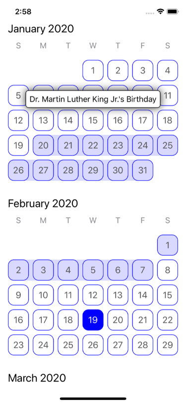

## Technical Details
If you'd like to learn about how `HorizonCalendar` was implemented, check out the [Technical Details](Docs/TECHNICAL_DETAILS.md) document. It provides an overview of `HorizonCalendar`'s architecture, along with information about why it's not implemented using `UICollectionView`. 

## Contributions
`HorizonCalendar` welcomes fixes, improvements, and feature additions. If you'd like to contribute, open a pull request with a detailed description of your changes. 

As a rule of thumb, if you're proposing an API-breaking change or a change to existing functionality, consider proposing it by opening an issue, rather than a pull request; we'll use the issue as a public forum for discussing whether the proposal makes sense or not. See [CONTRIBUTING](Docs/CONTRIBUTING.md) for more details.

## Authors
Bryan Keller
- https://github.com/bryankeller
- https://twitter.com/BKyourway19

## Maintainers
Bryan Keller
- https://github.com/bryankeller
- https://twitter.com/BKyourway19

Bryn Bodayle
- https://github.com/brynbodayle
- https://twitter.com/brynbodayle

If you or your company has found `HorizonCalendar` to be useful, let us know!

## License

`HorizonCalendar` is released under the Apache License 2.0. See [LICENSE](LICENSE) for details.
