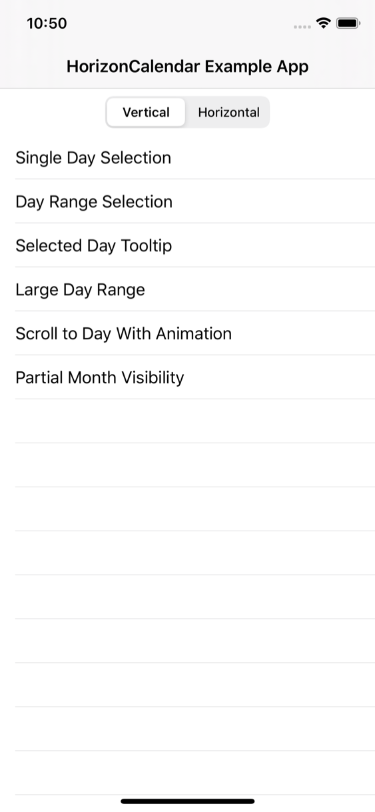
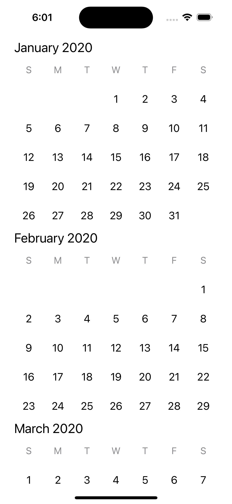
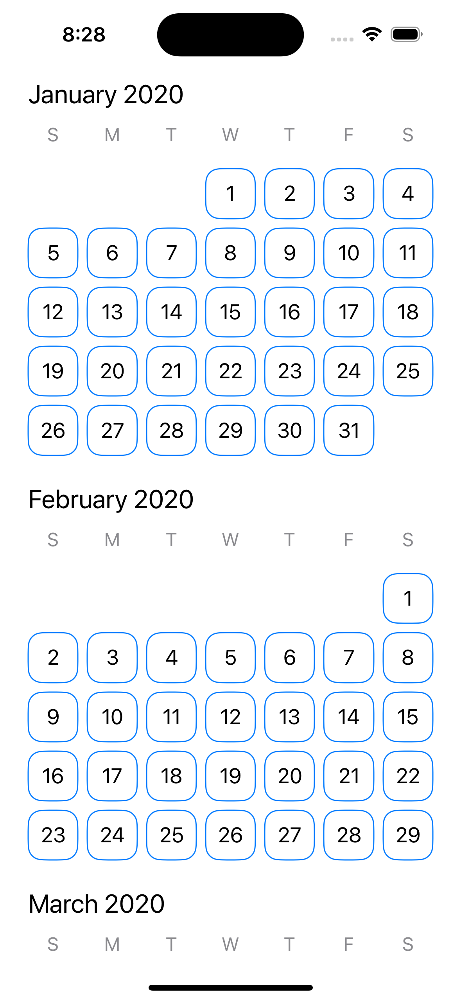
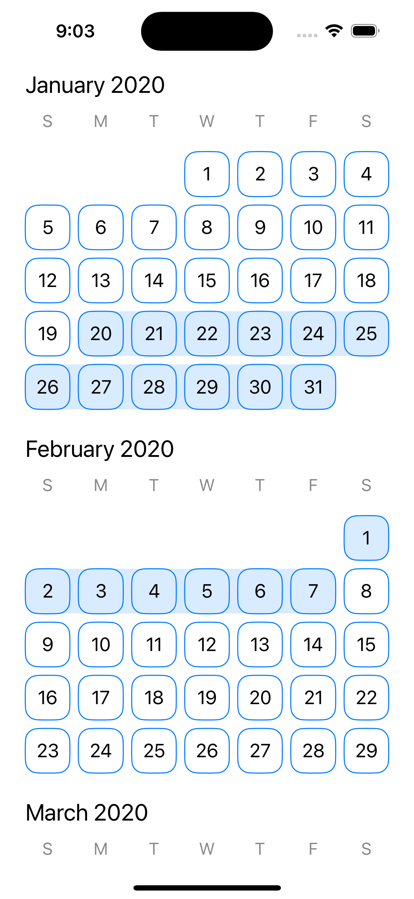
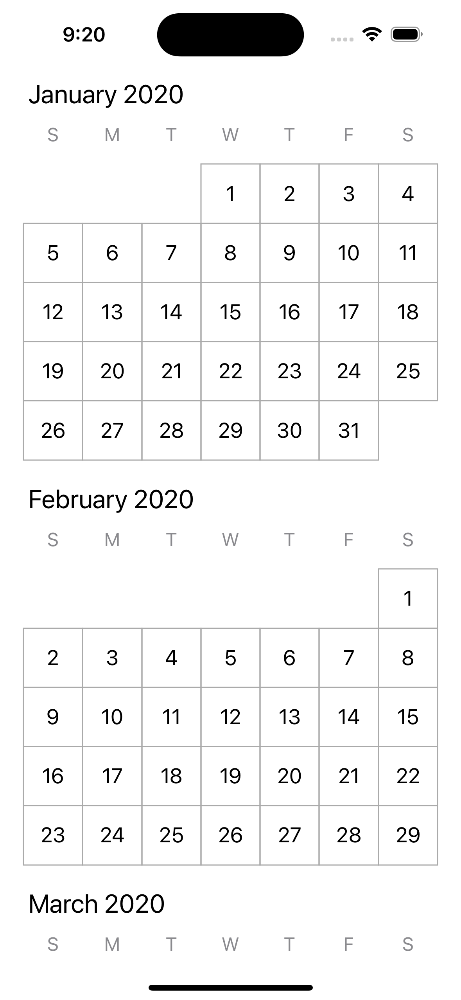

# HorizonCalendar
A declarative and performant calendar UI component that supports use cases ranging from simple date pickers all the way up to fully-featured calendar apps.

[](https://github.com/apple/swift-package-manager)
[](https://github.com/Carthage/Carthage)
[](https://cocoapods.org/pods/HorizonCalendar)
[](https://cocoapods.org/pods/HorizonCalendar)
[](https://cocoapods.org/pods/HorizonCalendar)

[](https://swiftpackageindex.com/airbnb/HorizonCalendar)

## Introduction
`HorizonCalendar` is a declarative and performant calendar UI component for iOS. It provides many customization points to support a diverse range of designs and use cases, and is used used to implement every calendar and date picker in the Airbnb iOS app.

Features:

- SwiftUI and UIKit support
- Vertical and horizontal month layouts
- Paging for horizontal month layout
- Right-to-left layout support
- Declarative API that encourages unidirectional data flow for updating the content of the calendar
- Supports displaying large (virtually-infinite) date ranges
- Animated content updates
- Customizable default views for days, month headers, and days of the week, and a month grid background
- Specify custom views for individual days, month headers, and days of the week
- Specify custom views to highlight date ranges
- Specify custom views to overlay parts of the calendar, enabling features like tooltips
- Specify custom views for month background decorations (colors, grids, etc.)
- Specify custom views for day background decorations (colors, patterns, etc.)
- A day selection handler to monitor when a day is tapped
- A multi-day selection handler to monitor when multiple days are selected via a drag gesture
- Customizable layout metrics
- Pin the days-of-the-week row to the top
- Show partial boundary months (exactly 2020-03-14 to 2020-04-20, for example)
- Scroll to arbitrary dates and months, with or without animation
- Robust accessibility support
- Inset the content without affecting the scrollable region using layout margins
- Separator below the days-of-the-week row
- Supports all calendars from `Foundation.Calendar` (Gregorian, Japanese, Hebrew, etc.)

| Search | Stays Availability Calendar | Wish List | Experience Reservation | Experience Host Calendar Management |
| --- | --- | --- | --- | --- |
|  |   |  |  |  |

## Table of Contents
- [Example App](#example-app)
  - [Demos](#demos)
    - [Single Day Selection](#single-day-selection)
    - [Day Range Selection](#day-range-selection)
    - [Selected Day Tooltip](#selected-day-tooltip)
    - [Scroll to Day with Animation](#scroll-to-day-with-animation)
- [Integration Tutorial](#integration-tutorial)
  - [Requirements](#requirements)
  - [Installation](#installation)
    - [Carthage](#carthage)
    - [CocoaPods](#cocoapods)
  - [Creating a calendar](#creating-a-calendar)
    - [Basic Setup](#basic-setup)
      - [Importing `HorizonCalendar`](#importing-horizoncalendar)
      - [Instantiating the view](#instantiating-the-view)
      - [Adding the view](#adding-the-view)
    - [Customization](#customization)
      - [Providing a custom view for each day](#providing-a-custom-view-for-each-day)
      - [Adjusting layout metrics](#adjusting-layout-metrics)
      - [Adding a day range indicator](#adding-a-day-range-indicator)
      - [Adding grid lines](#adding-grid-lines)
    - [Responding to day selection](#responding-to-day-selection)
- [Technical Details](#technical-details)
- [Contributions](#contributions)
- [Authors](#authors)
- [Maintainers](#maintainers)
- [License](#license)

## Example App
An example app is available to showcase and enable you to test some of `HorizonCalendar`'s features. It can be found in `./Example/HorizonCalendarExample.xcworkspace`. 

Note: Make sure to use the `.xcworkspace` file, and not the `.xcodeproj` file, as the latter does not have access to `HorizonCalendar.framework`.

### Demos
The example app has several demo view controllers to try, with both vertical and horizontal layout variations:



#### Single Day Selection
| Vertical | Horizontal |
| ---- | ---- |
|  |  |

#### Day Range Selection
| Vertical | Horizontal |
| ---- | ---- |
|  |  |

#### Selected Day Tooltip
| Vertical | Horizontal |
| ---- | ---- |
|  |  |

#### Scroll to Day with Animation
| Vertical | Horizontal |
| ---- | ---- |
|  |  |

## Integration Tutorial

### Requirements
- Deployment target iOS 11.0+
- Swift 5+
- Xcode 10.2+

### Installation
#### Swift Package Manager
To install `HorizonCalendar` using [Swift Package Manager](https://swift.org/package-manager/), add
`.package(name: "HorizonCalendar", url: "https://github.com/airbnb/HorizonCalendar.git", from: "1.0.0"),"` to your Package.swift, then follow the integration tutorial [here](https://swift.org/package-manager#importing-dependencies).

#### Carthage
To install `HorizonCalendar` using [Carthage](https://github.com/Carthage/Carthage), add
`github "airbnb/HorizonCalendar"` to your Cartfile, then follow the integration tutorial [here](https://github.com/Carthage/Carthage#if-youre-building-for-ios-tvos-or-watchos).

#### CocoaPods
To install `HorizonCalendar` using [CocoaPods](http://cocoapods.org), add
`pod 'HorizonCalendar'` to your Podfile, then follow the integration tutorial [here](https://guides.cocoapods.org/using/using-cocoapods.html).


## Creating a calendar
Once you've installed `HorizonCalendar` into your project, getting a basic calendar working is just a few steps.

### Basic Setup

#### Importing `HorizonCalendar`
At the top of the file where you'd like to use `HorizonCalendar`, import `HorizonCalendar`:
```swift
import HorizonCalendar 
```

#### Instantiating the view

<details>
  <summary>SwiftUI</summary>
  
  `CalendarViewRepresentable` is the SwiftUI view type that represents the calendar. Like other SwiftUI views, all customization is done through initializer parameters and modifiers. To create a basic calendar, you initialize a `CalendarViewRepresentable` with some initial data:
  
  ```swift
  let calendar = Calendar.current

  let startDate = calendar.date(from: DateComponents(year: 2020, month: 01, day: 01))!
  let endDate = calendar.date(from: DateComponents(year: 2021, month: 12, day: 31))!

  CalendarViewRepresentable(
    calendar: calendar,
    visibleDateRange: startDate...endDate,
    monthsLayout: .vertical(options: VerticalMonthsLayoutOptions()),
    dataDependency: nil)
  ```
  
</details>

<details>
  <summary>UIKit</summary>
  
  `CalendarView` is the `UIView` subclass that renders the calendar. All visual aspects of `CalendarView` are controlled through a single type - `CalendarViewContent`. To create a basic `CalendarView`, you initialize one with an initial `CalendarViewContent`:
  ```swift
  let calendarView = CalendarView(initialContent: makeContent())
  ```

  ```swift
  private func makeContent() -> CalendarViewContent {
    let calendar = Calendar.current

    let startDate = calendar.date(from: DateComponents(year: 2020, month: 01, day: 01))!
    let endDate = calendar.date(from: DateComponents(year: 2021, month: 12, day: 31))!

    return CalendarViewContent(
      calendar: calendar,
      visibleDateRange: startDate...endDate,
      monthsLayout: .vertical(options: VerticalMonthsLayoutOptions()))
  }
  ```

  At a minimum, `CalendarViewContent` must be initialized with a `Calendar`, a visible date range, and a months layout (either vertical or horizontal). The visible date range will be interpreted as a range of days using the `Calendar` instance passed in for the `calendar` parameter.

  For this example, we're using a Gregorian calendar, a date range of 2020-01-01 to 2021-12-31, and a vertical months layout.

  Make sure to add `calendarView` as a subview, then give it a valid frame either using Auto Layout or by manually setting its `frame` property. If you're using Auto Layout, note that `CalendarView` does not have an intrinsic content size.
  ```swift
  view.addSubview(calendarView)

  calendarView.translatesAutoresizingMaskIntoConstraints = false

  NSLayoutConstraint.activate([
    calendarView.leadingAnchor.constraint(equalTo: view.layoutMarginsGuide.leadingAnchor),
    calendarView.trailingAnchor.constraint(equalTo: view.layoutMarginsGuide.trailingAnchor),
    calendarView.topAnchor.constraint(equalTo: view.layoutMarginsGuide.topAnchor),
    calendarView.bottomAnchor.constraint(equalTo: view.layoutMarginsGuide.bottomAnchor),
  ])
  ```
  
</details>
  
At a minimum, you need to provide a `Calendar`, a visible date range, and a months layout (either vertical or horizontal). The visible date range will be interpreted as a range of days using the `Calendar` instance passed in for the `calendar` parameter.

For this example, we're using a Gregorian calendar, a date range of 2020-01-01 to 2021-12-31, and a vertical months layout.
  
#### Adding the view

Next, we'll add the calendar to the view hierarchy.

<details>
  <summary>SwiftUI</summary>
  
  Add your calendar to the view hierarchy like any other SwiftUI view. Since the calendar doesn't have an intrinsic content size, you'll need to use the `frame` modifier to tell SwiftUI that it should consume all vertical and horizontal space. Optionally, use the `layoutMargins` modifier to apply internal padding, and the normal SwiftUI `padding` modifier to apply some external padding from the parent's edges.
  ```swift
  var body: some View {
    CalendarViewRepresentable(...)
      .layoutMargins(.init(top: 8, leading: 8, bottom: 8, trailing: 8))
      .padding(.horizontal, 16)
      .frame(maxWidth: .infinity, maxHeight: .infinity)
  }
  ```
  
</details>

<details>
  <summary>UIKit</summary>
  
  Add your calendar as a subview, then give it a valid frame either using Auto Layout or by manually setting its `frame` property. If you're using Auto Layout, note that `CalendarView` does not have an intrinsic content size.
  ```swift
  view.addSubview(calendarView)

  calendarView.translatesAutoresizingMaskIntoConstraints = false

  NSLayoutConstraint.activate([
    calendarView.leadingAnchor.constraint(equalTo: view.layoutMarginsGuide.leadingAnchor),
    calendarView.trailingAnchor.constraint(equalTo: view.layoutMarginsGuide.trailingAnchor),
    calendarView.topAnchor.constraint(equalTo: view.layoutMarginsGuide.topAnchor),
    calendarView.bottomAnchor.constraint(equalTo: view.layoutMarginsGuide.bottomAnchor),
  ])
  ```
  
</details>

At this point, building and running your app should result in something that looks like this:



### Customization

#### Providing a custom view for each day
`HorizonCalendar` comes with default views for month headers, day of week items, and day items. You can also provide custom views for each of these item types, enabling you to display whatever custom content makes sense for your app.

Let's start by customizing the view used for each day:

<details>
  <summary>SwiftUI</summary>
  
  Since all visual aspects of `CalendarViewRepresentable` are configured through modifiers, we'll use the `days` modifier to provide a custom view with a rounded border for each day in the calendar:
  
  ```swift
  CalendarViewRepresentable(...)
  
    .days { day in
      Text("\(day.day)")
        .font(.system(size: 18))
        .foregroundColor(Color(UIColor.label))
        .frame(maxWidth: .infinity, maxHeight: .infinity)
        .overlay {
          RoundedRectangle(cornerRadius: 12)
            .stroke(Color(UIColor.systemBlue), lineWidth: 1)
        }
    }
  ```
  
  To use a UIKit view, wrap it using `UIViewRepresentable` and return it from the same function.
  
  > **Note**
  > 
  > View-provider closures are invoked lazily as parts of the calendar come into view. If you read any view state in any of your view-provider closures, make sure you capture it explicitly using a capture list. If you don't, SwiftUI will fail to identify that state as a dependency of your view unless it was read during the initial body evaluation of your view. This will lead to missed updates when your state changes.
  
</details>

<details>
  <summary>UIKit</summary>

  Since all visual aspects of `CalendarView` are configured through `CalendarViewContent`, we'll expand on our `makeContent` function. Let's start by providing a custom view for each day in the calendar:
  ```swift
  private func makeContent() -> CalendarViewContent {
    return CalendarViewContent(...)
      .dayItemProvider { day in
        // Return a `CalendarItemModel` representing the view for each day
      }
  }
  ```
  
  The `dayItemProvider(_:)` function on `CalendarViewContent` returns a new `CalendarViewContent` instance with the custom day item model provider configured. This function takes a single parameter - a provider closure that returns a `CalendarItemModel` for a given `DayComponents`.
  
  `CalendarItemModel` is a type that abstracts away the creation and configuration of a view displayed in the calendar. It's generic over a `ViewRepresentable` type, which can be any type conforming to `CalendarItemViewRepresentable`. You can think of `CalendarItemViewRepresentable` as a blueprint for creating and updating instances of a particular type of view to be displayed in the calendar. For example, if we want to use a `UILabel` for our custom day view with a rounded border, we'll need to create a type that knows how to create and update that label. Here's a simple example:
  ```swift
  import HorizonCalendar

  struct DayLabel: CalendarItemViewRepresentable {

    /// Properties that are set once when we initialize the view.
    struct InvariantViewProperties: Hashable {
      let font: UIFont
      let textColor: UIColor
      let borderColor: UIColor
    }

    /// Properties that will vary depending on the particular date being displayed.
    struct Content: Equatable {
      let day: DayComponents
    }

    static func makeView(
      withInvariantViewProperties invariantViewProperties: InvariantViewProperties)
      -> UILabel
    {
      let label = UILabel()
      
      label.isUserInteractionEnabled = true
      label.layer.borderWidth = 1
      label.layer.borderColor = invariantViewProperties.borderColor.cgColor
      label.font = invariantViewProperties.font
      label.textColor = invariantViewProperties.textColor

      label.textAlignment = .center
      label.clipsToBounds = true
      label.layer.cornerRadius = 12
      
      return label
    }

    static func setContent(_ content: Content, on view: UILabel) {
      view.text = "\(content.day.day)"
    }

  }
  ```

  `CalendarItemViewRepresentable` requires us to implement a `static` `makeView` function, which should create and return a view given a set of invariant view properties. We want our label to have a configurable font and text color, so we've made those configurable via the `InvariantViewProperties` type. In our `makeView` function, we use those invariant view properties to create and configure an instance of our label.

  `CalendarItemViewRepresentable` also requires us to implement a `static` `setContent` function, which should update all data-dependent properties (like the day text) on the provided view.

  Now that we have a type conforming to `CalendarItemViewRepresentable`, we can use it to create a `CalendarItemModel` to return from the day item model provider:

  ```swift
  return CalendarViewContent(...)

    .dayItemProvider { day in
      DayLabel.calendarItemModel(
        invariantViewProperties: .init(
          font: .systemFont(ofSize: 18), 
          textColor: .label,
          borderColor: .systemBlue),
        content: .init(day: day))
    }
  ```
  
  Using a SwiftUI view is even easier - simply initialize your SwiftUI view and call `.calendarItemModel` on it. There's no need to create a custom type conforming to `CalendarItemViewRepresentable` like we had to do with the UIKit example above, or have separate concepts for invariant and variant (content) view properties.

  ```swift
  return CalendarViewContent(...)

    .dayItemProvider { day in
      Text("\(day.day)")
        .font(.system(size: 18))
        .foregroundColor(Color(UIColor.label))
        .frame(maxWidth: .infinity, maxHeight: .infinity)
        .overlay {
          RoundedRectangle(cornerRadius: 12)
            .stroke(Color(UIColor.systemBlue), lineWidth: 1)
        }
        .calendarItemModel
    }
  ```

</details>

Similar item-provider functions are available to customize the views used for month headers, day-of-the-week items, and more.

If you build and run your app, it should now look like this:


#### Adjusting layout metrics
We can improve the layout of our current calendar by adding some additional spacing between individual days and months:

<details>
  <summary>SwiftUI</summary>
  
  ```swift
  CalendarViewRepresentable(...)
    .days { ... }

    .interMonthSpacing(24)
    .verticalDayMargin(8)
    .horizontalDayMargin(8)
```
  
</details>

<details>
  <summary>UIKit</summary>
  
  ```swift
  return CalendarViewContent(...)
    .dayItemProvider { ... }

    .interMonthSpacing(24)
    .verticalDayMargin(8)
    .horizontalDayMargin(8)
  ```
  
  Just like when we configured a custom day view via the day provider, changes to layout metrics are also done through `CalendarViewContent`. `interMonthSpacing(_:)`, `verticalDayMargin(_:)`, and `horizontalDayMargin(_:)` each return a mutated `CalendarViewContent` with the corresponding layout metric value updated, enabling you to chain function calls together to produce a final content instance.
  
</details>

After building and running your app, you should see a much less cramped layout:



#### Adding a day range indicator
Day range indicators are useful for calendars that need to highlight not just individual days, but ranges of days. To do this, we can create a custom view that represents the entire highlighted region, and then provide that view to the calendar for day ranges that we care about.

First, we need to create our custom day range indicator view. This view is responsible for drawing the entire highlighted region for a particular day range, which can potentially span multiple weeks, months, or even years. We'll use UIKit and Core Graphics to implement this, but it can easily be done in SwiftUI as well:

```swift
import UIKit

final class DayRangeIndicatorView: UIView {

  private let indicatorColor: UIColor

  init(indicatorColor: UIColor) {
    self.indicatorColor = indicatorColor
    super.init(frame: .zero)
    backgroundColor = .clear
  }

  required init?(coder: NSCoder) { fatalError("init(coder:) has not been implemented") }

  var framesOfDaysToHighlight = [CGRect]() {
    didSet {
      guard framesOfDaysToHighlight != oldValue else { return }
      setNeedsDisplay()
    }
  }

  override func draw(_ rect: CGRect) {
    let context = UIGraphicsGetCurrentContext()
    context?.setFillColor(indicatorColor.cgColor)

    // Get frames of day rows in the range
    var dayRowFrames = [CGRect]()
    var currentDayRowMinY: CGFloat?
    for dayFrame in framesOfDaysToHighlight {
      if dayFrame.minY != currentDayRowMinY {
        currentDayRowMinY = dayFrame.minY
        dayRowFrames.append(dayFrame)
      } else {
        let lastIndex = dayRowFrames.count - 1
        dayRowFrames[lastIndex] = dayRowFrames[lastIndex].union(dayFrame)
      }
    }

    // Draw rounded rectangles for each day row
    for dayRowFrame in dayRowFrames {
      let roundedRectanglePath = UIBezierPath(roundedRect: dayRowFrame, cornerRadius: 12)
      context?.addPath(roundedRectanglePath.cgPath)
      context?.fillPath()
    }
  }

}
```

Next, we need to create a `ClosedRange<Date>` that represents the day range for which we'd like to display our day range indicator view. The `Date`s in our range will be interpreted as `DayComponents`s using the `Calendar` instance that we used when initially setting up our calendar.
```swift
let lowerDate = calendar.date(from: DateComponents(year: 2020, month: 01, day: 20))!
let upperDate = calendar.date(from: DateComponents(year: 2020, month: 02, day: 07))!
let dateRangeToHighlight = lowerDate...upperDate
```

<details>
  <summary>SwiftUI</summary>
  
  Next, we'll use the `dayRanges` modifier on our `CalendarViewRepresentable`:
  ```swift
  CalendarViewRepresentable(...)
    ...
    
    .dayRanges(for: [dateRangeToHighlight]) { dayRangeLayoutContext in 
      DayRangeIndicatorViewRepresentable(
        framesOfDaysToHighlight: dayRangeLayoutContext.daysAndFrames.map { $0.frame })
    }
  ```

  For each day range derived from the `Set<ClosedRange<Date>>` passed into this modifier, our day range provider closure will be invoked with a context instance that contains all of the information needed for us to create a view to be used to highlight a particular day range. Since `DayRangeIndicatorView` is a `UIView`, we need to bridge it to SwiftUI using `UIViewRepresentable`:

  ```swift
  struct DayRangeIndicatorViewRepresentable: UIViewRepresentable {

    let framesOfDaysToHighlight: [CGRect]

    func makeUIView(context: Context) -> DayRangeIndicatorView {
      DayRangeIndicatorView(indicatorColor: UIColor.systemBlue.withAlphaComponent(0.15))
    }

    func updateUIView(_ uiView: DayRangeIndicatorView, context: Context) {
      uiView.framesOfDaysToHighlight = framesOfDaysToHighlight
    }

  }
  ```
  
  > **Note**
  > 
  > When wrapping a `UIKit` view in a `UIViewRepresentable`, there is no equivalent concept of invariant view properties; all customizable properties must be updated in `updateUIView` to prevent view-reuse issues.
  
</details>

<details>
  <summary>UIKit</summary>
  
  Next, we need to invoke the `dayRangeItemProvider(for:_:)` on our `CalendarViewContent`:
  ```swift
    return CalendarViewContent(...)
      ...
      
      .dayRangeItemProvider(for: [dateRangeToHighlight]) { dayRangeLayoutContext in 
        // Return a `CalendarItemModel` representing the view that highlights the entire day range
      }
  ```

  For each day range derived from the `Set<ClosedRange<Date>>` passed into this function, our day range item model provider closure will be invoked with a context instance that contains all of the information needed for us to render a view to be used to highlight a particular day range. Here is an example implementation of such a view:


  Next, we need a type that conforms to `CalendarItemViewRepresentable` that knows how to create and update instances of `DayRangeIndicatorView`. To make things easy, we can just make our view conform to this protocol:
  ```swift
  import HorizonCalendar

  extension DayRangeIndicatorView: CalendarItemViewRepresentable {

    struct InvariantViewProperties: Hashable {
      let indicatorColor: UIColor
    }

    struct Content: Equatable {
      let framesOfDaysToHighlight: [CGRect]
    }

    static func makeView(
      withInvariantViewProperties invariantViewProperties: InvariantViewProperties)
      -> DayRangeIndicatorView
    {
      DayRangeIndicatorView(indicatorColor: invariantViewProperties.indicatorColor)
    }

    static func setContent(_ content: Content, on view: DayRangeIndicatorView) {
      view.framesOfDaysToHighlight = content.framesOfDaysToHighlight
    }

  }
  ```

  Last, we need to return a `CalendarItemModel` representing our `DayRangeIndicatorView` from the day range item model provider closure:
  ```swift
    return CalendarViewContent(...)
      ...
      
      .dayRangeItemProvider(for: [dateRangeToHighlight]) { dayRangeLayoutContext in
        DayRangeIndicatorView.calendarItemModel(
          invariantViewProperties: .init(indicatorColor: UIColor.blue.withAlphaComponent(0.15)),
          content: .init(framesOfDaysToHighlight: dayRangeLayoutContext.daysAndFrames.map { $0.frame }))
      }
  ```
  
</details>

If you build and run the app, you should see a day range indicator view that highlights 2020-01-20 to 2020-02-07:



#### Adding grid lines
`HorizonCalendar` provides an API to add a decorative background behind each month. By using the included `MonthGridBackgroundView`, we can easily add grid lines to each of the months in the calendar:

<details>
  <summary>SwiftUI</summary>
  
  ```swift
  CalendarViewRepresentable(...)

    .monthBackgrounds { monthLayoutContext in
      MonthGridBackgroundViewRepresentable(
        framesOfDays: monthLayoutContext.daysAndFrames.map { $0.frame })
    }
  ```
  
  Since `MonthGridBackgroundView` is a `UIView`, we need to bridge it to SwiftUI using `UIViewRepresentable`:

  ```swift
  struct MonthGridBackgroundViewRepresentable: UIViewRepresentable {

    let framesOfDays: [CGRect]

    func makeUIView(context: Context) -> MonthGridBackgroundView {
      MonthGridBackgroundView(
        invariantViewProperties: .init(horizontalDayMargin: 8, verticalDayMargin: 8))
    }

    func updateUIView(_ uiView: MonthGridBackgroundView, context: Context) {
      uiView.framesOfDays = framesOfDays
    }

  }
  ```
  
  > **Note**
  > 
  > When wrapping a `UIKit` view in a `UIViewRepresentable`, there is no equivalent concept of invariant view properties; all customizable properties must be updated in `updateUIView` to prevent view-reuse issues. 
  
</details>

<details>
  <summary>UIKit</summary>
  
  ```swift
  return CalendarViewContent(...)
    
    .monthBackgroundItemProvider { monthLayoutContext in
      MonthGridBackgroundView.calendarItemModel(
        invariantViewProperties: .init(horizontalDayMargin: 8, verticalDayMargin: 8),
        content: .init(framesOfDays: monthLayoutContext.daysAndFrames.map { $0.frame }))
    }
  ```
  
</details>

The month background provider works similarly to the overlay provider and day range provider; for each month in the calendar, the provider closure will be invoked with a layout context. This layout context contains information about the size and positions of elements in the month. Using this information, you can draw grid lines, borders, backgrounds, and more.




### Responding to day selection
If you're building a date picker, you'll most likely need to respond to the user tapping on days in the calendar.

<details>
  <summary>SwiftUI</summary>
  
  In SwiftUI, responding to day selection is easy.
  
  First, define a state property for the current selected date:
  ```swift
  @State var selectedDate: Date?
  ```
  
  Then, update the selected date using the `onDaySelection` modifier:
  ```swift
  CalendarViewRepresentable(...)
    ...
    
    .onDaySelection { day in
      selectedDate = calendar.date(from: day.components)
    }
  ```
  
  Last, return a different view in your day provider closure:
  ```swift
  CalendarViewRepresentable(...)
    ...
    
    .days { [selectedDate] day in
      let date = calendar.date(from: day.components)
      let borderColor: UIColor = date == selectedDate ? .systemRed : .systemBlue
      
      Text("\(day.day)")
        .font(.system(size: 18))
        .foregroundColor(Color(UIColor.label))
        .frame(maxWidth: .infinity, maxHeight: .infinity)
        .overlay {
          RoundedRectangle(cornerRadius: 12)
            .stroke(Color(borderColor), lineWidth: 1)
        }
    }
  ```
  
  > **Note**
  > 
  > View-provider closures are invoked lazily as parts of the calendar come into view. If you read any view state in any of your view-provider closures, make sure you capture it explicitly using a capture list. If you don't, SwiftUI will fail to identify that state as a dependency of your view unless it was read during the initial body evaluation of your view. This will lead to missed updates when your state changes.
  
</details>

<details>
  <summary>UIKit</summary>
  
  In UIKit, provide a day selection handler closure by setting `CalendarView`'s `daySelectionHandler`:
  
  ```swift
  calendarView.daySelectionHandler = { [weak self] day in
    self?.selectedDate = calendar.date(from: day.components)
  }
  ```
  
  ```swift
  private var selectedDate: Date?
  ```
  
  The day selection handler closure is invoked whenever a day in the calendar is selected. You're provided with a `DayComponents` instance for the day that was selected. If we want to highlight the selected day once its been tapped, we'll need to create a new `CalendarViewContent` with a day calendar item model that looks different for the selected day:
  ```swift
  let selectedDay = self.selectedDay

  return CalendarViewContent(...)
    ...

    .dayItemProvider { [selectedDate] day in
      let date = calendar.date(from: day.components)
      let borderColor: UIColor = date == selectedDate ? .systemRed : .systemBlue

      return DayLabel.calendarItemModel(
        invariantViewProperties: .init(
          font: .systemFont(ofSize: 18),
          textColor: .label,
          borderColor: borderColor),
        content: .init(day: day))
    }
  ```

  Last, we'll change our day selection handler so that it not only stores the selected date, but also sets an updated content instance on `calendarView`:
  ```swift
  calendarView.daySelectionHandler = { [weak self] day in
    guard let self else { return }

    selectedDate = calendar.date(from: day.components)

    let newContent = makeContent()
    calendarView.setContent(newContent)
  }
  ```
  
</details>

After building and running the app, tapping days should cause them to turn blue:


## Technical Details
If you'd like to learn about how `HorizonCalendar` was implemented, check out the [Technical Details](Docs/TECHNICAL_DETAILS.md) document. It provides an overview of `HorizonCalendar`'s architecture, along with information about why it's not implemented using `UICollectionView`. 

## Contributions
`HorizonCalendar` welcomes fixes, improvements, and feature additions. If you'd like to contribute, open a pull request with a detailed description of your changes. 

As a rule of thumb, if you're proposing an API-breaking change or a change to existing functionality, consider proposing it by opening an issue, rather than a pull request; we'll use the issue as a public forum for discussing whether the proposal makes sense or not. See [CONTRIBUTING](Docs/CONTRIBUTING.md) for more details.

## Authors
Bryan Keller
- https://github.com/bryankeller
- https://twitter.com/BKyourway19

## Maintainers
Bryan Keller
- https://github.com/bryankeller
- https://twitter.com/BKyourway19

Bryn Bodayle
- https://github.com/brynbodayle
- https://twitter.com/brynbodayle

If you or your company has found `HorizonCalendar` to be useful, let us know!

## License

`HorizonCalendar` is released under the Apache License 2.0. See [LICENSE](LICENSE) for details.
